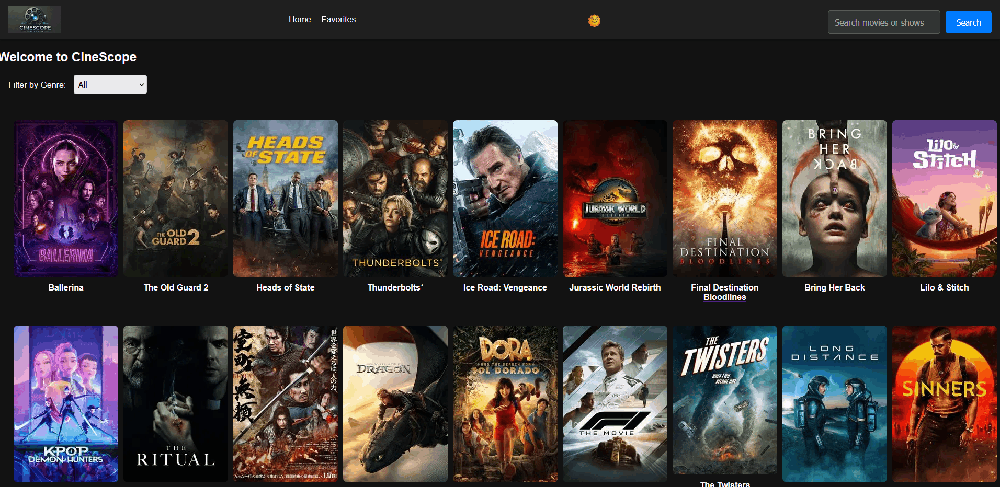

# 🎬 CineScope

**CineScope** is a sleek movie explorer app built with **React**, powered by the [TMDb API](https://www.themoviedb.org/). Users can search, view details, and save their favorite titles — all with a Netflix-inspired design.

---

### 🎥 Demo Preview



---

## 🚀 Live Demo

👉 [Visit CineScope on Netlify](https://cinescope-eli.netlify.app/)

---

## ✨ Features

- 🔍 Search for movies and TV shows via TMDb API
- 🎬 View detailed movie pages (overview, release date, cast, images)
- 📁 Filter movies by genre
- ❤️ Save/remove favorites (persisted with `localStorage`)
- 🌙 Light/Dark mode toggle
- 🧭 Multi-page app using React Router
- ⚛️ Built with functional components and custom hooks
- 📱 Fully responsive UI (desktop & mobile)

---

## 🧰 Tech Stack

- **React 18**
- **React Router v6+**
- **Axios**
- **Vite**
- **Context API**
- **TMDb API**

---

## 🛠 Getting Started

### 📦 Prerequisites

- Node.js & npm installed

### 🔧 Installation

```bash
git clone https://github.com/EliasRajha/react-cinescope.git
cd REACT-CineScope
npm install
npm run dev
